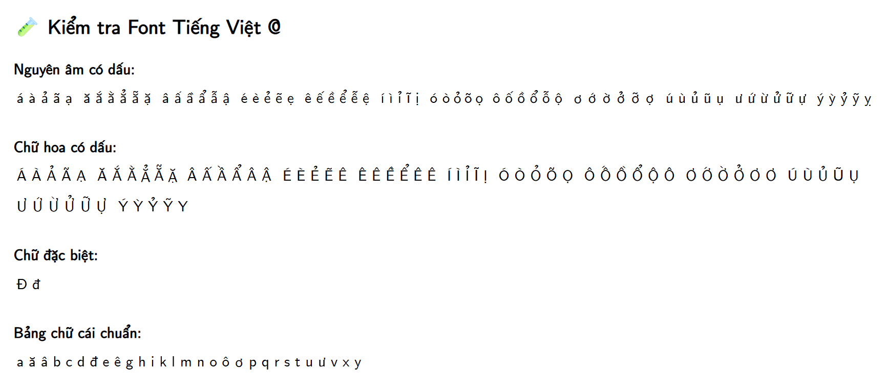

# Font Việt hóa cho dangth.dev

Đây là phiên bản Việt hóa của một font mã nguồn mở, được mình (Dang Tran Huu) tùy chỉnh để hỗ trợ đầy đủ bảng chữ cái tiếng Việt có dấu (gồm 134 ký tự in thường và in hoa). Font này hiện đang được sử dụng trên blog cá nhân của mình: [https://dangth.dev](https://dangth.dev)



## ✨ Tính năng

- ✅ Hỗ trợ đầy đủ tiếng Việt (dấu thanh, chữ ghép, `ă â ê ô ơ ư đ`…)
- ✅ Tối ưu cho giao diện web và hiển thị bài viết blog
- ✅ Bao gồm định dạng `.ttf` và `.woff` (dùng cho cả desktop lẫn website)
- ✅ Gắn sẵn metadata: tên tác giả, bản quyền, mô tả

## 📄 Bản quyền

Font gốc: [CMU-Sans-Serif](https://online-fonts.com/fonts/cmu-sans-serif)  
Việt hóa bởi: **Dang Tran Huu**  
Giấy phép: **MIT License** (xem `LICENSE.txt`)

> Bạn được phép sử dụng miễn phí cho cả mục đích cá nhân và thương mại.  
> Không bắt buộc ghi tên tác giả, nhưng rất hoan nghênh nếu bạn ghi nguồn: [https://dangth.dev](https://dangth.dev)

## 📦 Nội dung

- `FontName-Vietnam.ttf` — Font chính cho desktop
- `FontName-Vietnam.woff` — Phiên bản nén cho website
- `LICENSE.txt` — Giấy phép sử dụng
- `test.html` — Trang kiểm tra font tiếng Việt

## 💡 Sử dụng trong HTML

```html
<style>
  @font-face {
    font-family: 'MyVietnamFont';
    src: url('./FontName-Vietnam.woff') format('woff');
  }
  body {
    font-family: 'MyVietnamFont', sans-serif;
  }
</style>
```


Made with ☕ & ❤️ by Dang Tran Huu


---